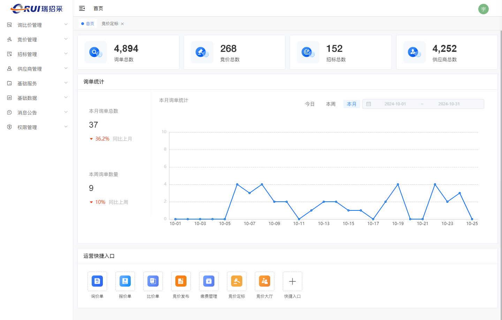
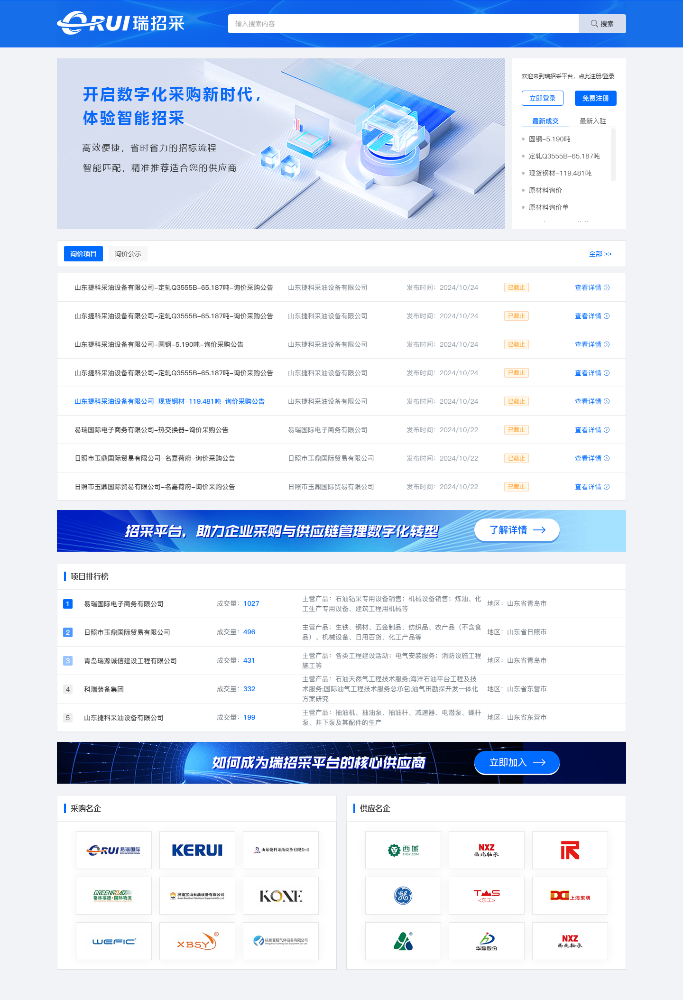

# 瑞招采

#### 项目介绍
瑞招采，是全新推出的一款轻量级、高性能、前后端分离的采购管理系统，后端源码完全开源，包含供应商管理、采购询价、采购竞价、采购招标等功能。

#### 技术特点

1. 前后端完全分离 (互不依赖 开发效率高)
2. 采用PHP8.2+
3. lumen（轻量级PHP开发框架）
4. Ant Design Vue（企业级中后台产品UI组件库）
5. Composer一键引入三方扩展
6. 简约高效的编码风格 

#### 安装教程

教程地址：https://doc.ruizhaocai.com/#/deploy/

#### 环境要求

1.  CentOS 7.0+ 、Ubuntu 20+
2.  Nginx 1.10+
3.  PHP 8.2
4.  MySQL 5.7+

#### 页面演示

#### 系统演示
采购商管理后台地址 https://demo.ruizhaocai.com/front

供应商后台管理地址 https://demo.ruizhaocai.com/front

采购商前台网站地址 https://demo.ruizhaocai.com/

采购商账号：admin 密码：ecp@2024

供应商账号：gys@163.com 密码：ecp@2024

#### 定时任务

用于自动处理招标采购系统自动开标以及报名截至等时间相关状态的更新

php artisan schedule:run 

#### 消息队列

用于邮件等的处理

php artisan queue:listen

#### 消息通信

用于竞价信息同步

php artisan workman start|stop|restart

#### 安全&缺陷

如果您碰到安装和使用问题可以加群联系管理员，将操作流程和截图详细发出来，我们看到后会给出解决方案。

如果有BUG或者安全问题，我们会第一时间修复。

#### 微信交流群

